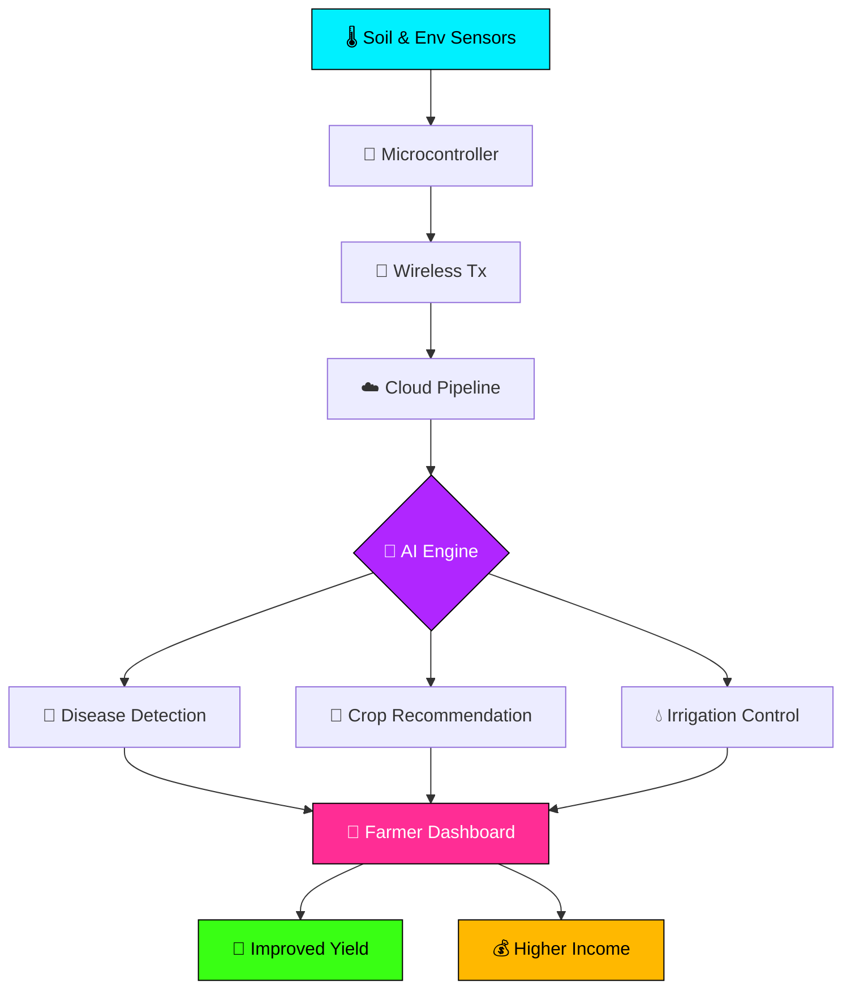
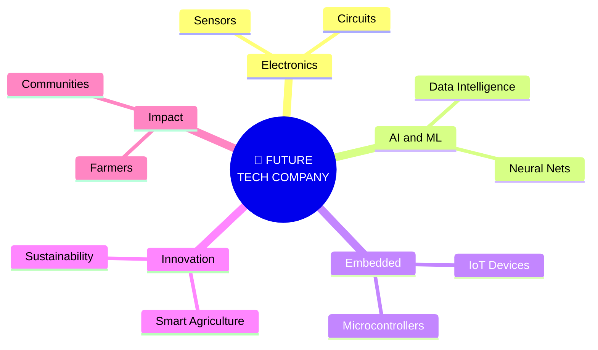

<div align="center">

<!-- LAYER 1: HERO CAPSULE BANNER -->


<br/>

<!-- LAYER 2: ROTATING TYPING SVG 1 -->
<a href="https://git.io/typing-svg">
  
</a>

<br/><br/>

<!-- LAYER 3: NEON STATUS BADGES -->


<br/><br/>

<!-- LAYER 4: DYNAMIC COUNTERS ROW -->


<br/><br/>

<!-- LAYER 5: SOCIAL BUTTONS -->
[](#)
[](#)
[](mailto:your.email@example.com)
[](#)
[](#)

</div>

<br/>

<!-- LAYER 6: ANIMATED DIVIDER 1 -->


<!-- SECTION 2: ABOUT ME -->
## `╭─[sabeeshvar@portfolio]─[~/about]`
## `╰─$ cat identity.yml`

<table>
  <tr>
    <td width="60%" valign="top">

```yaml
┌─── IDENTITY.YML ───┐
name        : "Sabeeshvar M."
role        : "ECE Undergrad | Semester 4"
institution : "VSB Engineering College"
cgpa        : 7.8 / 10.0
graduation  : 2028
location    : "Tamil Nadu, India"
status      : "🟢 Building & Learning"
focus       :
  - "Electronics & Circuits"
  - "Embedded Systems"
  - "Artificial Intelligence"
  - "IoT & Automation"
  - "Smart Agriculture"
mission     : "Turn circuits into solutions."
dream       : "Build my own tech company."
└────────────────────┘
```

    </td>
    <td width="40%" align="center" valign="middle">
      
    </td>
  </tr>
</table>

<br/>

<div align="center">

<a href="https://git.io/typing-svg">
  
</a>

</div>

<br/>

<details>
  <summary><b>🎓 Educational Timeline (Click to expand)</b></summary>
  <br/>
  <table>
    <tr>
      <th align="left" width="40%">DEGREE / QUALIFICATION</th>
      <th align="left" width="35%">INSTITUTION</th>
      <th align="center" width="25%">METRICS / YEAR</th>
    </tr>
    <tr>
      <td><b>B.E. Electronics & Communication Engineering</b></td>
      <td>VSB Engineering College</td>
      <td align="center"><b>CGPA 7.8</b> • 4th Sem (Grad 2028)</td>
    </tr>
    <tr>
      <td><b>Class 12 (Higher Secondary)</b></td>
      <td>Veveaham Matric Hr. Sec. School</td>
      <td align="center"><b>88.8%</b></td>
    </tr>
    <tr>
      <td><b>Class 10 (SSLC)</b></td>
      <td>Thebmalar Matric Hr. Sec. School</td>
      <td align="center"><b>88.8%</b></td>
    </tr>
  </table>
</details>

<br/>

<!-- ANIMATED DIVIDER 2 -->


<!-- SECTION 3: TECH ARSENAL -->
## `╭─[sabeeshvar@portfolio]─[~/tech_arsenal]`
## `╰─$ ls -la ~/skills/`

<div align="center">

### ▸ LANGUAGES
<a href="https://skillicons.dev">
  
</a>

<br/><br/>

### ▸ HARDWARE
<a href="https://skillicons.dev">
  
</a>

<br/><br/>

### ▸ AI & DATA
<a href="https://skillicons.dev">
  
</a>

<br/><br/>

### ▸ TOOLS
<a href="https://skillicons.dev">
  
</a>

<br/><br/>

### ▸ SKILL PROGRESS METRICS


<br/>


<br/><br/>

### ▸ DOMAIN EXPERTISE CLUSTER


<br/>


</div>

<br/>

<!-- ANIMATED DIVIDER 3 -->


<!-- SECTION 4: FLAGSHIP PROJECT AGROPULSE -->
## `╭─[sabeeshvar@portfolio]─[~/flagship]`
## `╰─$ ./launch --project agropulse`

<div align="center">


<br/>


</div>

<br/>

<table style="border-left: 4px solid #00F0FF;">
  <tr>
    <td width="50%" valign="top">
      <h3 align="center">🎯 WHAT IT DOES</h3>
      <ul>
        <li><b>🌡️ Real-Time Sensor Monitoring:</b> Continuous field tracking of soil moisture, humidity, temperature, and NPK levels.</li>
        <li><b>🤖 AI-Powered Crop Recommendations:</b> Data-driven agricultural insights matching soil composition.</li>
        <li><b>💧 Smart Irrigation Guidance:</b> Automated closed-loop actuation based on predictive moisture algorithms.</li>
        <li><b>☁️ Weather-Based Farming Insights:</b> Live weather forecast telemetry piped to decision models.</li>
        <li><b>🦠 Crop Disease Diagnosis:</b> Early-stage plant pathogen detection using intelligent image evaluation.</li>
        <li><b>📱 Farmer-Focused Dashboard:</b> Unified visual web & mobile interface for operational alerts.</li>
        <li><b>🧠 Live Crop Intelligence Engine:</b> Multi-sensor data fusion to maximize seasonal crop yield.</li>
      </ul>
    </td>
    <td width="50%" valign="top">
      <h3 align="center">⚙️ TECH STACK</h3>

```diff
+ Artificial Intelligence
+ Internet of Things (IoT)
+ Sensor Networks
+ Embedded Systems
+ Data Analysis
+ Smart Agriculture Framework
```

      <hr/>
      <blockquote>
        <i>"Empower every farmer with an intelligent digital assistant powered by electronics + AI."</i>
      </blockquote>
    </td>
  </tr>
</table>

<br/>

### 📐 AgroPulse System Architecture



<br/>

<div align="center">

### 💡 WHY AGROPULSE?
- **Water Conservation:** Reduces irrigation waste by over 35% through precision soil actuation.
- **Disease Prevention:** Early AI diagnostic alerts protect crops before fungal spread.
- **Data-Driven Farming:** Transforms traditional manual agriculture into data-backed decision making.

</div>

<br/>

<!-- ANIMATED DIVIDER 1 -->


<!-- SECTION 5: OTHER PROJECTS -->
## `╭─[sabeeshvar@portfolio]─[~/projects]`
## `╰─$ ls -la ~/other_projects/`

<table>
  <tr>
    <td width="50%" valign="top" style="border: 2px solid #B026FF;">
      <h3 align="center">🧠 HarvestIQ</h3>
      <p align="center"><b>AI-Powered Smart Agriculture Platform</b></p>
      <ul>
        <li><b>🌾 AI Crop Recommendation:</b> Machine learning model evaluating soil health to suggest crops.</li>
        <li><b>🛒 Seed Marketplace:</b> Verified marketplace connecting farmers directly with seed suppliers.</li>
        <li><b>☁️ Weather & Irrigation:</b> Dynamic forecasting integrated with watering schedule advisories.</li>
        <li><b>🦠 Disease Detection:</b> Plant disease diagnosis powered by image classification and farmer UI.</li>
      </ul>
      <br/>
      <div align="center">
        <code>AI</code> <code>Web Dev</code> <code>Agriculture</code> <code>Data</code> <code>Smart Farming</code>
      </div>
    </td>
    <td width="50%" valign="top" style="border: 2px solid #B026FF;">
      <h3 align="center">🔌 Embedded Systems Lab</h3>
      <p align="center"><b>Hardware × Software Integration</b></p>
      <ul>
        <li><b>💻 Microcontrollers:</b> Prototyping custom firmware for sensor data acquisition and control.</li>
        <li><b>📡 IoT Devices:</b> Wireless telemetry nodes transmitting sensor data streams over protocols.</li>
        <li><b>⚡ Automation:</b> Hardware automation logic for real-time sensor processing and actuation.</li>
        <li><b>🔬 Hardware Debugging:</b> Oscilloscope & logic analyzer telemetry verification.</li>
      </ul>
      <br/>
      <div align="center">
        <code>Embedded</code> <code>IoT</code> <code>Sensors</code> <code>Automation</code> <code>Electronics</code>
      </div>
    </td>
  </tr>
</table>

<br/>

<p align="center">
  <i>🧪 More projects deploying every semester. Star my repos to stay updated.</i>
</p>

<br/>

<!-- ANIMATED DIVIDER 2 -->


<!-- SECTION 6: EXPERIENCE -->
## `╭─[sabeeshvar@portfolio]─[~/experience]`
## `╰─$ cat industry_exposure.log`

<table>
  <tr>
    <td width="50%" valign="top">
      <h3 align="center">📡 BSNL</h3>
      <p align="center"><b>Internship Experience</b></p>
      <p>Gained practical insights into telecommunications infrastructure, network switching systems, data transmission protocols, and core telecom hardware operations.</p>
      <br/>
      <div align="center">
        
        
        
      </div>
    </td>
    <td width="50%" valign="top">
      <h3 align="center">🔬 MICROSUN Technology</h3>
      <p align="center"><b>Internship Experience</b></p>
      <p>Acquired direct industrial exposure to tech workflows, engineering practices, hardware automation modules, and practical electronics implementations.</p>
      <br/>
      <div align="center">
        
        
        
      </div>
    </td>
  </tr>
</table>

<br/>

<!-- ANIMATED DIVIDER 3 -->


<!-- SECTION 7: CERTIFICATIONS -->
## `╭─[sabeeshvar@portfolio]─[~/credentials]`
## `╰─$ ls -la ~/certifications/`

<div align="center">

<table>
  <tr>
    <td align="center" width="20%">
      <br/>
      <b>NPTEL</b><br/>
      <small>Academic Excellence</small>
    </td>
    <td align="center" width="20%">
      <br/>
      <b>Salesforce</b><br/>
      <small>Cloud & Systems</small>
    </td>
    <td align="center" width="20%">
      <br/>
      <b>Java Core</b><br/>
      <small>Software Engineering</small>
    </td>
    <td align="center" width="20%">
      <br/>
      <b>Python</b><br/>
      <small>Data & Automation</small>
    </td>
    <td align="center" width="20%">
      <br/>
      <b>Data Analysis</b><br/>
      <small>Analytics Core</small>
    </td>
  </tr>
</table>

</div>

<br/>

<!-- ANIMATED DIVIDER 1 -->


<!-- SECTION 8: HACKATHONS & ACHIEVEMENTS -->
## `╭─[sabeeshvar@portfolio]─[~/achievements]`
## `╰─$ cat honors.txt`

<table>
  <tr>
    <td width="50%" valign="top">
      <h3 align="center">🏆 HACKATHONS</h3>
      <ul>
        <li><b>🇮🇳 Smart India Hackathon (SIH) Participant:</b> Developed tech-driven solutions addressing national-level problems.</li>
        <li><b>🚀 Liro 2026 Participant:</b> Built sustainable engineering solutions fusing smart technology and environmental awareness.</li>
        <li><b>💡 Sustainability Solutions:</b> Designing real-world hardware & software integration prototypes.</li>
      </ul>
    </td>
    <td width="50%" valign="top">
      <h3 align="center">🎖️ ACHIEVEMENTS & ACTIVITIES</h3>
      <ul>
        <li><b>🏅 Handball:</b> Competitive player representing in collegiate handball tournaments.</li>
        <li><b>🤼 Kabaddi:</b> Active sports team competitor exhibiting leadership and endurance.</li>
        <li><b>⚡ Electronics Club Member:</b> Active contributor organizing club events and technical activities.</li>
        <li><b>🎯 Technical Events:</b> Participant in collegiate symposiums and engineering challenges.</li>
      </ul>
    </td>
  </tr>
</table>

<br/>

<!-- ANIMATED DIVIDER 2 -->


<!-- SECTION 9: GITHUB STATS & COMMITS -->
## `╭─[sabeeshvar@portfolio]─[~/github/analytics]`
## `╰─$ ./fetch-stats --all --commits --live`

<div align="center">

<a href="https://git.io/typing-svg">
  
</a>

<br/><br/>

<!-- ROW 1: MAIN STATS & TOP LANGS -->
<table>
  <tr>
    <td width="50%" align="center">
      
    </td>
    <td width="50%" align="center">
      
    </td>
  </tr>
</table>

<br/>

<!-- ROW 2: STREAK STATS -->


<br/><br/>

<!-- ROW 3: PROFILE SUMMARY CARDS (4 CARDS) -->
<table>
  <tr>
    <td width="50%" align="center">
      
    </td>
    <td width="50%" align="center">
      
    </td>
  </tr>
  <tr>
    <td width="50%" align="center">
      
    </td>
    <td width="50%" align="center">
      
    </td>
  </tr>
</table>

<br/>

<!-- ROW 4: ACTIVITY GRAPH -->


<br/><br/>

<!-- ROW 5: COMMIT COUNTERS BADGES ROW -->


<br/>


<br/><br/>

<!-- ROW 6: CONTRIBUTION HEATMAP -->
### 📊 CONTRIBUTION HEATMAP


<br/><br/>

<!-- ROW 7: CONTRIBUTION SNAKE -->
### 🐍 CONTRIBUTION SNAKE ANIMATION


<br/><br/>

<!-- ROW 8: TROPHIES -->


</div>

<br/>

<!-- ANIMATED DIVIDER 3 -->


<!-- SECTION 10: CURRENTLY LEARNING -->
## `╭─[sabeeshvar@portfolio]─[~/learning]`
## `╰─$ python3 learning_focus.py`

```python
class SabeeshvarLearning2025:
    def __init__(self):
        self.name = "Sabeeshvar M."
        self.status = "🟢 Always Learning"

    def current_focus(self):
        return {
            "🧠 AI/ML"         : "Neural nets, applied AI",
            "🔌 Embedded"      : "RTOS, microcontrollers",
            "🌐 IoT"           : "Sensor networks, edge",
            "🔬 VLSI"          : "Digital design, chips",
            "💻 Web Dev"       : "Full-stack modern",
            "📊 Data Analysis" : "Raw data → insight",
            "🌾 Smart Agri"    : "AI + IoT for farming",
            "⚡ Electronics"   : "Advanced circuits"
        }

    def daily_routine(self):
        return "Code → Build → Break → Learn → Repeat"

me = SabeeshvarLearning2025()
```

<br/>

<!-- ANIMATED DIVIDER 1 -->


<!-- SECTION 11: BUILDING BEYOND CODE -->
## `╭─[sabeeshvar@portfolio]─[~/vision]`
## `╰─$ ./run --vision-startup`

<div align="center">


<br/>

> *"I don't want to build technology just for the sake of building projects. My goal is to create practical solutions that solve real problems and eventually build my own technology-driven company."*

<br/>

<a href="https://git.io/typing-svg">
  
</a>

</div>

<br/>

### 🧠 ENTREPRENEURIAL MINDMAP



<br/>

<table>
  <tr>
    <td width="33%" align="center">
      <h3>🔬 RESEARCH</h3>
      <p>Investigating core challenges in agriculture and hardware to design real solutions.</p>
    </td>
    <td width="33%" align="center">
      <h3>🛠️ BUILD</h3>
      <p>Fusing microcontrollers, AI models, and cloud telemetry into scalable products.</p>
    </td>
    <td width="33%" align="center">
      <h3>🚀 SCALE</h3>
      <p>Transitioning prototypes into commercial technology enterprises for community impact.</p>
    </td>
  </tr>
</table>

<br/>

<p align="center">
  <b>◈ Engineer meaningful technology · Empower real communities · Build a company that matters ◈</b>
</p>

<br/>

<div align="center">
  
</div>

<br/>

<!-- ANIMATED DIVIDER 2 -->


<!-- SECTION 12: CONNECT -->
## `╭─[sabeeshvar@portfolio]─[~/connect]`
## `╰─$ ./connect --with sabeeshvar`

<div align="center">

<a href="https://git.io/typing-svg">
  
</a>

<br/><br/>


<br/><br/>

<!-- SOCIAL BUTTON GRID 2x4 -->
<table>
  <tr>
    <td align="center" width="25%">
      <a href="#">
        
      </a>
    </td>
    <td align="center" width="25%">
      <a href="#">
        
      </a>
    </td>
    <td align="center" width="25%">
      <a href="mailto:your.email@example.com">
        
      </a>
    </td>
    <td align="center" width="25%">
      <a href="#">
        
      </a>
    </td>
  </tr>
  <tr>
    <td align="center" width="25%">
      <a href="#">
        
      </a>
    </td>
    <td align="center" width="25%">
      <a href="#">
        
      </a>
    </td>
    <td align="center" width="25%">
      <a href="#">
        
      </a>
    </td>
    <td align="center" width="25%">
      <a href="#">
        
      </a>
    </td>
  </tr>
</table>

<br/><br/>

<p align="center">
  <code>📍 Tamil Nadu, India • 🎓 VSB Engineering College • 🚀 Class of 2028 • 💼 Open to Opportunities</code>
</p>

<blockquote>
  <i>"Have an idea? Let's turn it into reality. ⚡"</i>
</blockquote>

<br/><br/>

<!-- FOOTER BANNER -->


<br/><br/>

<p align="center">
  <b>⚡ An engineer's digital identity — not just a GitHub README ⚡</b>
</p>

<p align="center">
  <i>Thanks for scrolling all the way down. That means a lot. 🙏</i>
</p>

</div>

<!--
SETUP INSTRUCTIONS:
1. Replace YOUR_GITHUB_USERNAME with your real GitHub username (appears ~15 times)
2. Replace all # links with your real social URLs
3. Replace your.email@example.com with your real email
4. Enable Snake Animation:
   Create .github/workflows/snake.yml with Platane/snk@v3 action
   Target branch: output
5. Enable Profile Summary Cards:
   Create .github/workflows/profile-summary-cards.yml
   Use vn7n24fzkq/github-profile-summary-cards@release
6. Enable Activity Graph:
   Visit https://github.com/Ashutosh00710/github-readme-activity-graph
   and follow setup instructions
7. Push to your username/username repository
-->
