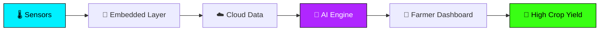
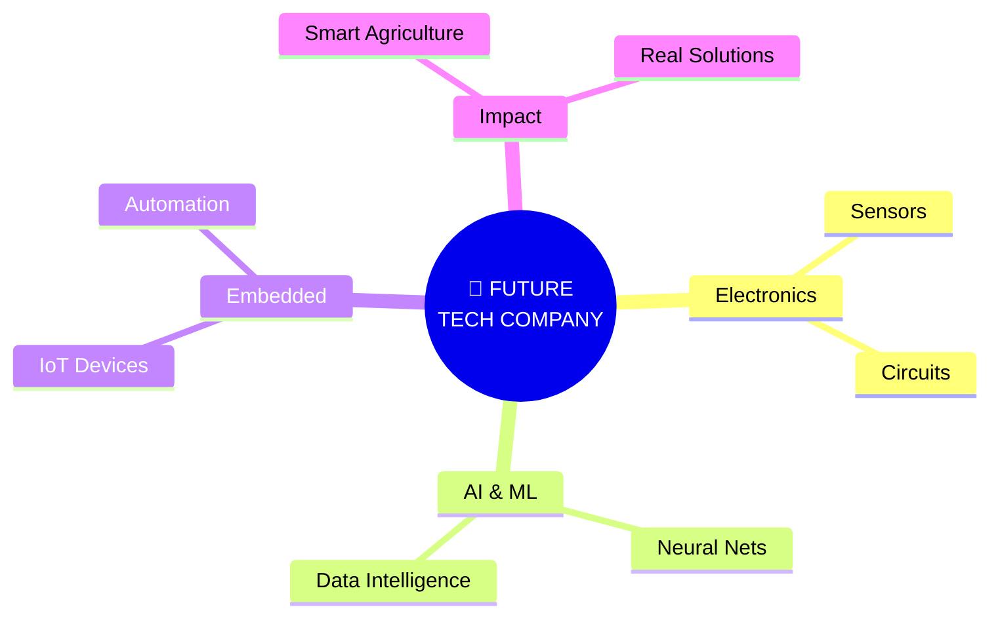

<div align="center">

<!-- HERO BANNER -->


<br/>

<!-- TYPING SVG -->
<a href="#"></a>

<br/><br/>

<!-- HERO BADGES -->


<br/><br/>

<!-- VISITOR COUNTER -->


<br/><br/>

<!-- SOCIALS -->
<a href="https://github.com/sabeeshvar"></a>
<a href="#"></a>
<a href="mailto:sabeeshvar@gmail.com"></a>
<a href="#"></a>

</div>

<br/>


<!-- SECTION 2: ABOUT ME -->
## ⚡ system.whoami()

<table>
  <tr>
    <td width="60%" valign="top">

```yaml
identity:
  name        : "Sabeeshvar M."
  role        : "ECE Undergrad | Semester 4"
  institution : "VSB Engineering College"
  cgpa        : 7.8 / 10.0
  graduation  : 2028
  location    : "Tamil Nadu, India"
  focus       :
    - "Electronics & Hardware"
    - "Embedded Systems & Microcontrollers"
    - "Artificial Intelligence & ML"
    - "IoT & Sensor Networks"
    - "Smart Agriculture Automation"
  mission     : "Turning circuits, code and creativity into real-world impact."
```

    </td>
    <td width="40%" align="center" valign="middle">
      
    </td>
  </tr>
</table>

<br/>

<details>
  <summary>🎓 Education Details</summary>
  <br/>
  <table>
    <tr>
      <th align="left" width="40%">DEGREE / QUALIFICATION</th>
      <th align="left" width="35%">INSTITUTION</th>
      <th align="center" width="25%">METRICS / YEAR</th>
    </tr>
    <tr>
      <td><b>B.E. Electronics & Communication Engineering</b></td>
      <td>VSB Engineering College</td>
      <td align="center"><b>CGPA 7.8</b> • 4th Sem (Grad 2028)</td>
    </tr>
    <tr>
      <td><b>Class 12 (Higher Secondary)</b></td>
      <td>Veveaham Matric Hr. Sec. School</td>
      <td align="center"><b>88.8%</b></td>
    </tr>
    <tr>
      <td><b>Class 10 (SSLC)</b></td>
      <td>Thebmalar Matric Hr. Sec. School</td>
      <td align="center"><b>88.8%</b></td>
    </tr>
  </table>
</details>

<br/>


<!-- SECTION 3: TECH ARSENAL -->
## 🛠️ tech.stack()

<div align="center">

### ▸ LANGUAGES
<a href="https://skillicons.dev">
  
</a>

<br/><br/>

### ▸ HARDWARE & EMBEDDED
<a href="https://skillicons.dev">
  
</a>

<br/><br/>

### ▸ TOOLS & AI
<a href="https://skillicons.dev">
  
</a>

<br/><br/>

### ▸ DOMAIN SPECIALIZATION BADGES


<br/>


</div>

<br/>


<!-- SECTION 4: FEATURED PROJECT -->
## 🌾 flagship.project()

<div align="center">


<br/>


</div>

<br/>

<table>
  <tr>
    <td width="50%" valign="top">
      <h3 align="center">🎯 CORE CAPABILITIES</h3>
      <ul>
        <li><b>Sensor-Based Field Monitoring:</b> Tracking soil moisture, humidity, temperature, and nutrient metrics in real-time.</li>
        <li><b>AI-Based Crop Recommendations:</b> Intelligent crop and soil advisories matching predictive models.</li>
        <li><b>Smart Irrigation Guidance:</b> Automated closed-loop watering actuation based on moisture analytics.</li>
        <li><b>Weather-Based Farming Insights:</b> Live weather forecast telemetry piped directly to decision algorithms.</li>
        <li><b>Crop Disease Diagnosis:</b> AI-driven image evaluation for early pathogen detection.</li>
        <li><b>Farmer-Focused Dashboard:</b> Unified visual web & mobile interface for operational alerts.</li>
      </ul>
    </td>
    <td width="50%" valign="top">
      <h3 align="center">⚙️ TECH & FRAMEWORKS</h3>

```diff
+ Artificial Intelligence
+ Internet of Things (IoT)
+ Sensor Networks
+ Embedded Systems
+ Data Analysis
+ Smart Agriculture
```

    </td>
  </tr>
</table>

<br/>

### 📐 AgroPulse System Architecture



<br/>


<!-- SECTION 5: OTHER PROJECTS -->
## 🚀 additional.projects()

<table>
  <tr>
    <td width="50%" valign="top">
      <h3 align="center">🧠 HarvestIQ</h3>
      <p align="center"><b>AI-Powered Smart Agriculture Platform</b></p>
      <ul>
        <li>Crop recommendation engine based on soil health analytics.</li>
        <li>Integrated seed marketplace connecting verified suppliers.</li>
        <li>Weather guidance and dynamic irrigation advisories.</li>
        <li>AI plant disease detection with a farmer-friendly UI.</li>
      </ul>
      <br/>
      <div align="center">
        
        
        
        
      </div>
    </td>
    <td width="50%" valign="top">
      <h3 align="center">🔌 Embedded Systems Lab</h3>
      <p align="center"><b>Hardware × Software Integration</b></p>
      <ul>
        <li>Microcontroller prototypes and custom sensor firmware.</li>
        <li>Wireless IoT devices transmitting real-time telemetry.</li>
        <li>Hardware problem solving and automation logic.</li>
        <li>Real-time sensor arrays and hardware debugging.</li>
      </ul>
      <br/>
      <div align="center">
        
        
        
        
      </div>
    </td>
  </tr>
</table>

<br/>


<!-- SECTION 6: EXPERIENCE & INTERNSHIPS -->
## 💼 industry.exposure()

<table>
  <tr>
    <td width="50%" valign="top">
      <h3 align="center">📡 BSNL</h3>
      <p align="center"><b>Internship Experience</b></p>
      <p>Gained practical insights into telecommunications infrastructure, switching systems, network hardware operations, and data transmission protocols.</p>
      <br/>
      <div align="center">
        
        
        
      </div>
    </td>
    <td width="50%" valign="top">
      <h3 align="center">🔬 MICROSUN Technology</h3>
      <p align="center"><b>Internship Experience</b></p>
      <p>Acquired direct industrial exposure to tech workflows, engineering practices, practical electronics implementations, and hardware modules.</p>
      <br/>
      <div align="center">
        
        
        
      </div>
    </td>
  </tr>
</table>

<br/>


<!-- SECTION 7: CERTIFICATIONS & HACKATHONS -->
## 🏆 achievements.verify()

<table>
  <tr>
    <td width="50%" valign="top">
      <h3 align="center">🏆 HACKATHONS & CLUBS</h3>
      <ul>
        <li><b>Smart India Hackathon (SIH):</b> Participant building real-world tech solutions.</li>
        <li><b>Liro 2026:</b> Participant developing sustainable engineering projects.</li>
        <li><b>Electronics Club Member:</b> Active contributor organizing club events and technical activities.</li>
        <li><b>Technical Event Participant:</b> Engaging in collegiate technical symposiums.</li>
        <li><b>Sports Achievements:</b> Handball and Kabaddi team player.</li>
      </ul>
    </td>
    <td width="50%" valign="top">
      <h3 align="center">📜 CERTIFICATIONS</h3>
      <div align="center">
        <br/><br/>
        <br/><br/>
        <br/><br/>
        <br/><br/>
        
      </div>
    </td>
  </tr>
</table>

<br/>


<!-- SECTION 8: GITHUB ANALYTICS & COMMITS -->
## 📊 github.analytics()

<div align="center">

<!-- ROW 1: MAIN STATS & TOP LANGS -->
<table>
  <tr>
    <td width="50%" align="center">
      
    </td>
    <td width="50%" align="center">
      
    </td>
  </tr>
</table>

<br/>

<!-- ROW 2: STREAK STATS -->


<br/><br/>

<!-- ROW 3: ACTIVITY GRAPH -->


<br/><br/>

<!-- ROW 4: CONTRIBUTION SNAKE -->


</div>

<br/>


<!-- SECTION 9: BUILDING BEYOND CODE (VISION) -->
## 🚀 entrepreneurial.vision()

<div align="center">


<br/>

> "I don't want to build technology just for the sake of building projects. My goal is to create practical solutions that solve real problems and eventually build my own technology-driven company."

<br/>



</div>

<br/>


<!-- SECTION 10: CONNECT WITH ME -->
## 🌐 connect.init()

<div align="center">


<br/><br/>

<!-- SOCIALS HTML TABLE -->
<table>
  <tr>
    <td align="center" width="25%">
      <a href="https://github.com/sabeeshvar">
        
      </a>
    </td>
    <td align="center" width="25%">
      <a href="#">
        
      </a>
    </td>
    <td align="center" width="25%">
      <a href="mailto:sabeeshvar@gmail.com">
        
      </a>
    </td>
    <td align="center" width="25%">
      <a href="#">
        
      </a>
    </td>
  </tr>
</table>

<br/><br/>


</div>
