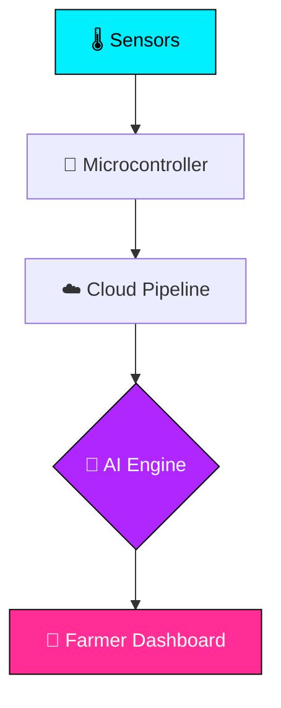
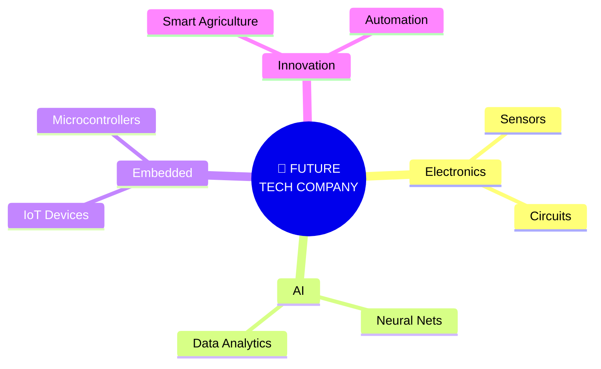

<div align="center">

<!-- HERO BANNER -->


<br/>

<!-- TYPING SVG -->
<a href="#"></a>

<br/><br/>

<!-- HERO BADGES -->


<br/><br/>

<!-- VISITOR COUNTER -->


<br/><br/>

<!-- SOCIALS -->
<a href="https://github.com/sabeeshvar"></a>
<a href="#"></a>
<a href="mailto:sabeeshvar@gmail.com"></a>
<a href="#"></a>

</div>

<br/>


<!-- SECTION 2: ABOUT ME -->
## ⚡ `sabeeshvar@portfolio:~/$ ./about_me`

<table>
  <tr>
    <td width="60%" valign="top">

```yaml
identity:
  name        : "Sabeeshvar M."
  role        : "Electronics & Communication Engineering Student"
  institution : "VSB Engineering College"
  department  : "ECE"
  semester    : "4th Semester"
  cgpa        : 7.8
  graduation  : 2028
  location    : "Tamil Nadu, India"
  focus       :
    - "Embedded Systems & Microcontrollers"
    - "Artificial Intelligence & ML"
    - "IoT & Sensor Networks"
    - "Smart Agriculture Automation"
  mission     : "Building intelligent technology that connects electronics, AI and real-world impact."
```

    </td>
    <td width="40%" align="center" valign="middle">
      
    </td>
  </tr>
</table>

<br/>

<details>
  <summary>🎓 Educational Timeline</summary>
  <br/>
  <table>
    <tr>
      <th align="left" width="40%">DEGREE / QUALIFICATION</th>
      <th align="left" width="35%">INSTITUTION</th>
      <th align="center" width="25%">METRICS / YEAR</th>
    </tr>
    <tr>
      <td><b>B.E. Electronics & Communication Engineering</b></td>
      <td>VSB Engineering College</td>
      <td align="center"><b>CGPA 7.8</b> • 4th Sem (Grad 2028)</td>
    </tr>
    <tr>
      <td><b>Class 12 (Higher Secondary)</b></td>
      <td>Veveaham Matric Hr. Sec. School</td>
      <td align="center"><b>88.8%</b></td>
    </tr>
    <tr>
      <td><b>Class 10 (SSLC)</b></td>
      <td>Thebmalar Matric Hr. Sec. School</td>
      <td align="center"><b>88.8%</b></td>
    </tr>
  </table>
</details>

<br/>


<!-- SECTION 3: TECH ARSENAL -->
## ⚡ `sabeeshvar@portfolio:~/$ ls -la /skills`

<div align="center">

### ▸ LANGUAGES
<a href="https://skillicons.dev">
  
</a>

<br/><br/>

### ▸ HARDWARE & EMBEDDED
<a href="https://skillicons.dev">
  
</a>

<br/><br/>

### ▸ TOOLS & PLATFORMS
<a href="https://skillicons.dev">
  
</a>

<br/><br/>

### ▸ DOMAIN SPECIALIZATION BADGES


</div>

<br/>


<!-- SECTION 4: AGROPULSE (FLAGSHIP) -->
## ⚡ `sabeeshvar@portfolio:~/$ ./launch_project --agropulse`

<div align="center">


<br/>


</div>

<br/>

<table>
  <tr>
    <td width="50%" valign="top">
      <h3 align="center">🎯 CORE FEATURES</h3>
      <ul>
        <li><b>Real-Time Sensor Monitoring:</b> Tracking soil moisture, humidity, temperature, and nutrient metrics.</li>
        <li><b>AI Recommendations:</b> Intelligent crop and soil advisories based on predictive models.</li>
        <li><b>Smart Irrigation Guidance:</b> Automated closed-loop watering actuation.</li>
        <li><b>Crop Disease Diagnosis:</b> AI-driven image evaluation for early pathogen detection.</li>
      </ul>
    </td>
    <td width="50%" valign="top">
      <h3 align="center">⚙️ TECH STACK</h3>

```diff
+ Artificial Intelligence
+ Internet of Things (IoT)
+ Sensor Networks
+ Embedded Systems
+ Data Analysis
+ Smart Agriculture Framework
```

    </td>
  </tr>
</table>

<br/>

### 📐 AgroPulse System Architecture



<br/>


<!-- SECTION 5: OTHER PROJECTS -->
## ⚡ `sabeeshvar@portfolio:~/$ ./view_projects`

<table>
  <tr>
    <td width="50%" valign="top">
      <h3 align="center">🧠 HarvestIQ</h3>
      <p align="center"><b>AI-Powered Smart Agriculture Platform</b></p>
      <ul>
        <li>Crop recommendation engine based on soil health analytics.</li>
        <li>Integrated digital marketplace for seeds and farming inputs.</li>
        <li>Weather guidance and dynamic irrigation advisories.</li>
        <li>AI plant disease detection with a clean farmer UI.</li>
      </ul>
      <br/>
      <div align="center">
        
        
        
      </div>
    </td>
    <td width="50%" valign="top">
      <h3 align="center">🔌 Embedded Systems Lab</h3>
      <p align="center"><b>Hardware × Software Integration</b></p>
      <ul>
        <li>Microcontroller firmware prototyping and sensor interfacing.</li>
        <li>Wireless IoT telemetry nodes transmitting sensor data.</li>
        <li>Automated hardware control routines and real-time processing.</li>
        <li>Oscilloscope and logic analyzer telemetry debugging.</li>
      </ul>
      <br/>
      <div align="center">
        
        
        
      </div>
    </td>
  </tr>
</table>

<br/>


<!-- SECTION 6: EXPERIENCE -->
## ⚡ `sabeeshvar@portfolio:~/$ cat experience.log`

<table>
  <tr>
    <td width="50%" valign="top">
      <h3 align="center">📡 BSNL</h3>
      <p align="center"><b>Internship Experience</b></p>
      <p>Gained practical insights into telecommunications infrastructure, network switching systems, data routing, and telecom operations.</p>
      <br/>
      <div align="center">
        
        
      </div>
    </td>
    <td width="50%" valign="top">
      <h3 align="center">🔬 MICROSUN Technology</h3>
      <p align="center"><b>Internship Experience</b></p>
      <p>Acquired direct industrial exposure to engineering workflows, practical electronics design, and hardware automation modules.</p>
      <br/>
      <div align="center">
        
        
      </div>
    </td>
  </tr>
</table>

<br/>


<!-- SECTION 7: CERTIFICATIONS & ACHIEVEMENTS -->
## ⚡ `sabeeshvar@portfolio:~/$ ./achievements`

<table>
  <tr>
    <td width="50%" valign="top">
      <h3 align="center">🏆 HACKATHONS & ACHIEVEMENTS</h3>
      <ul>
        <li><b>Smart India Hackathon (SIH):</b> Participant building real-world tech solutions.</li>
        <li><b>Liro 2026:</b> Participant developing sustainable engineering projects.</li>
        <li><b>Sports:</b> Handball and Kabaddi team player.</li>
        <li><b>Club Member:</b> Active participant in Electronics & Communication Club.</li>
      </ul>
    </td>
    <td width="50%" valign="top">
      <h3 align="center">📜 CERTIFICATIONS</h3>
      <div align="center">
        <br/><br/>
        <br/><br/>
        <br/><br/>
        <br/><br/>
        
      </div>
    </td>
  </tr>
</table>

<br/>


<!-- SECTION 8: GITHUB STATS & COMMITS -->
## ⚡ `sabeeshvar@portfolio:~/$ ./fetch-stats --live`

<div align="center">

<!-- ROW 1: MAIN STATS & TOP LANGS -->
<table>
  <tr>
    <td width="50%" align="center">
      
    </td>
    <td width="50%" align="center">
      
    </td>
  </tr>
</table>

<br/>

<!-- ROW 2: STREAK STATS -->


<br/><br/>

<!-- ROW 3: ACTIVITY GRAPH -->


<br/><br/>

<!-- ROW 4: CONTRIBUTION SNAKE -->


</div>

<br/>


<!-- SECTION 9: BUILDING BEYOND CODE (VISION) -->
## ⚡ `sabeeshvar@portfolio:~/$ ./vision --future`

<div align="center">


<br/>

> *"My goal is to create practical solutions that solve real problems and eventually build my own technology-driven company."*

<br/>



</div>

<br/>


<!-- SECTION 10: CONNECT -->
## ⚡ `sabeeshvar@portfolio:~/$ ./connect --network`

<div align="center">


<br/><br/>

<!-- SOCIALS HTML TABLE -->
<table>
  <tr>
    <td align="center" width="25%">
      <a href="https://github.com/sabeeshvar">
        
      </a>
    </td>
    <td align="center" width="25%">
      <a href="#">
        
      </a>
    </td>
    <td align="center" width="25%">
      <a href="mailto:sabeeshvar@gmail.com">
        
      </a>
    </td>
    <td align="center" width="25%">
      <a href="#">
        
      </a>
    </td>
  </tr>
</table>

<br/><br/>


</div>
