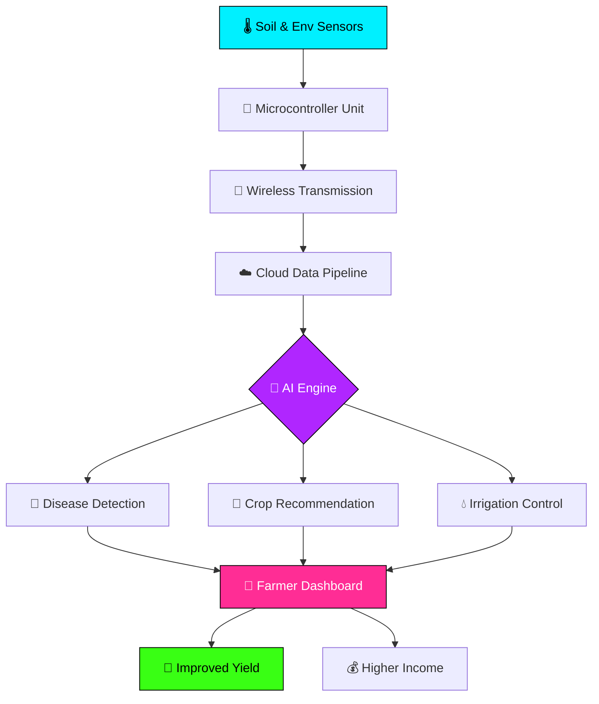
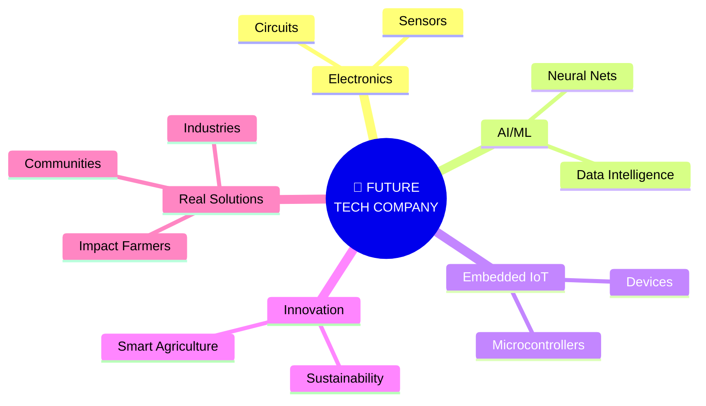

<div align="center">

<!-- HERO HEADER BANNER -->


<br/>

<!-- ASCII TERMINAL HEADER -->
```text
  ____    _    ____  _____ _____ ____  _   ___   ___  ____    __  __ 
 / ___|  / \  | __ )| _____| ____/ ___|| | | \ \ / / \|  _ \  |  \/  |
 \___ \ / _ \ |  _ \|  _|  |  _| \___ \| |_| |\ V /| |_) | | |\/| |
  ___) / ___ \| |_) | |___ | |___ ___) |  _  | | | |  _ <  | |  | |
 |____/_/   \_\____/|_____|_____|____/|_| |_| |_| |_| \_\ |_|  |_|
```

<!-- ANIMATED MULTI-LINE TYPING SVG 1 -->
<a href="https://git.io/typing-svg">
  
</a>

<br/><br/>

<!-- NEON STATUS BADGES -->


<br/><br/>

<!-- SOCIAL ACTION BADGES -->
[](https://github.com/sabeeshvar)
[](#)
[](mailto:sabeeshvar@gmail.com)
[](#)

</div>

<br/>


<!-- SECTION 2: ABOUT ME -->
## `╭─$ cat ~/whoami.yml`

<table>
  <tr>
    <td width="60%" valign="top">

```yaml
engineer:
  name        : "Sabeeshvar M."
  role        : "ECE Undergraduate | 4th Semester"
  institution : "VSB Engineering College"
  cgpa        : 7.8
  graduation  : 2028
  focus       : ["Electronics", "AI", "Embedded Systems", "IoT", "Smart Agriculture"]
  mission     : "Turning circuits, code and creativity into real-world impact."
  mode        : "Learning • Building • Innovating • Scaling"
```

> **Electronics & Communication Engineering undergraduate** exploring the high-octane intersection of embedded hardware, microcontrollers, and artificial intelligence. Driven by a passion for hardware that thinks and software that solves real-world problems. Primary focus centers on smart agriculture, IoT telemetry, high-impact hackathons, and hardware-software integration with a long-term vision of establishing a technology-driven enterprise.

<br/>

<a href="https://git.io/typing-svg">
  
</a>

    </td>
    <td width="40%" align="center" valign="middle">
      
    </td>
  </tr>
</table>

<br/>

<details>
  <summary><b>🎓 Educational Timeline (Click to expand)</b></summary>
  <br/>
  <table>
    <tr>
      <th align="left" width="40%">DEGREE / QUALIFICATION</th>
      <th align="left" width="35%">INSTITUTION</th>
      <th align="center" width="25%">METRICS / YEAR</th>
    </tr>
    <tr>
      <td><b>B.E. Electronics & Communication Engineering</b></td>
      <td>VSB Engineering College</td>
      <td align="center"><b>CGPA 7.8</b> • 4th Sem (Grad 2028)</td>
    </tr>
    <tr>
      <td><b>Class 12 (Higher Secondary)</b></td>
      <td>Veveaham Matric Hr. Sec. School</td>
      <td align="center"><b>88.8%</b></td>
    </tr>
    <tr>
      <td><b>Class 10 (SSLC)</b></td>
      <td>Thebmalar Matric Hr. Sec. School</td>
      <td align="center"><b>88.8%</b></td>
    </tr>
  </table>
</details>

<br/>


<!-- SECTION 3: TECH ARSENAL -->
## `╭─$ ls -la ~/skills/`

<div align="center">

### ▓▓▓ LANGUAGES ▓▓▓
<a href="https://skillicons.dev">
  
</a>

<br/><br/>

### ▓▓▓ HARDWARE & EMBEDDED ▓▓▓
<a href="https://skillicons.dev">
  
</a>

<br/><br/>

### ▓▓▓ AI & DATA ▓▓▓
<a href="https://skillicons.dev">
  
</a>

<br/><br/>

### ▓▓▓ TOOLS & PLATFORMS ▓▓▓
<a href="https://skillicons.dev">
  
</a>

</div>

<br/><br/>

### ▓▓▓ SKILL PROGRESS BARS ▓▓▓

<div align="center">


<br/>


</div>

<br/><br/>

### ▓▓▓ DOMAIN EXPERTISE ▓▓▓

<div align="center">


<br/>


</div>

<br/>


<!-- SECTION 4: FLAGSHIP PROJECT AGROPULSE -->
## `╭─$ ./run --project agropulse`

<div align="center">


<br/>


</div>

<br/>

<table>
  <tr>
    <td width="50%" valign="top">
      <h3 align="center">🎯 WHAT IT DOES</h3>
      <ul>
        <li><b>🌡️ Real-Time Sensor Monitoring:</b> Continuous field tracking of soil moisture, humidity, temperature, and NPK levels.</li>
        <li><b>🤖 AI-Powered Crop Recommendations:</b> Data-driven agricultural insights matching soil composition.</li>
        <li><b>💧 Smart Irrigation Guidance:</b> Automated closed-loop actuation based on predictive moisture algorithms.</li>
        <li><b>☁️ Weather-Based Farming Insights:</b> Live weather forecast telemetry piped to decision models.</li>
        <li><b>🦠 Crop Disease Diagnosis:</b> Early-stage plant pathogen detection using intelligent image evaluation.</li>
        <li><b>📱 Farmer Telemetry Dashboard:</b> Unified visual web & mobile interface for operational alerts.</li>
        <li><b>🧠 Live Crop Intelligence Engine:</b> Multi-sensor data fusion to maximize seasonal crop yield.</li>
      </ul>
    </td>
    <td width="50%" valign="top">
      <h3 align="center">⚙️ TECH STACK</h3>

```diff
+ Artificial Intelligence
+ Internet of Things (IoT)
+ Sensor Networks
+ Embedded Systems
+ Data Analysis
+ Smart Agriculture Framework
```

      <hr/>
      <blockquote>
        <i>"Empower every farmer with an intelligent digital assistant powered by electronics + AI."</i>
      </blockquote>
    </td>
  </tr>
</table>

<br/>

### 📐 AgroPulse Cyber-Physical Data Flow



<br/>

### 🌟 KEY FEATURE SHOWCASE

<table>
  <tr>
    <td width="33%" align="center">
      <h4>📡 SENSOR TELEMETRY</h4>
      <p>Continuous edge data acquisition tracking soil moisture, temperature & ambient humidity in real-time.</p>
    </td>
    <td width="33%" align="center">
      <h4>🧠 AI DIAGNOSTICS</h4>
      <p>Predictive ML models analyzing crop health parameters to detect plant diseases early.</p>
    </td>
    <td width="33%" align="center">
      <h4>💧 AUTOMATED IRRIGATION</h4>
      <p>Closed-loop relay control triggering precise water discharge only when soil thresholds drop.</p>
    </td>
  </tr>
</table>

<br/>

### ❓ WHY AGROPULSE?
- **Resource Conservation:** Reduces water usage by up to 40% through targeted closed-loop irrigation.
- **Yield Optimization:** Protects crops against disease through early-stage AI diagnostic alerts.
- **Data-Driven Farming:** Replaces guesswork with precision telemetry for rural farming communities.

<br/>


<!-- SECTION 5: OTHER PROJECTS -->
## `╭─$ ls -la ~/projects/`

<a href="https://git.io/typing-svg">
  
</a>

<br/><br/>

<table>
  <tr>
    <td width="50%" valign="top">
      <h3 align="center">🧠 HarvestIQ</h3>
      <p align="center"><b>AI-Powered Smart Agriculture Platform</b></p>
      <ul>
        <li><b>🌾 AI Crop Recommendation:</b> Machine learning engine suggesting optimal crops based on soil data.</li>
        <li><b>🛒 Seed Marketplace:</b> Integrated digital portal connecting farmers with verified suppliers.</li>
        <li><b>☁️ Weather & Irrigation Guidance:</b> Predictive watering schedules derived from climate metrics.</li>
        <li><b>🦠 Disease Detection:</b> Visual plant health evaluation with an intuitive farmer UI.</li>
      </ul>
      <br/>
      <div align="center">
        <code>AI</code> <code>Agriculture</code> <code>Web Dev</code> <code>Data</code> <code>Smart Farming</code>
        <br/><br/>
        <a href="https://github.com/sabeeshvar"><b>View Project →</b></a>
      </div>
    </td>
    <td width="50%" valign="top">
      <h3 align="center">🔌 Embedded Systems Lab</h3>
      <p align="center"><b>Hardware × Software Integration</b></p>
      <ul>
        <li><b>💻 Microcontroller Prototyping:</b> Custom firmware design and sensor interfacing routines.</li>
        <li><b>📡 IoT Device Nodes:</b> Real-time telemetry streaming over wireless communication protocols.</li>
        <li><b>⚡ Hardware Automation:</b> Automated actuator triggering and real-time hardware debugging.</li>
        <li><b>🔬 Sensor Networks:</b> Multi-sensor arrays for environmental and industrial telemetry.</li>
      </ul>
      <br/>
      <div align="center">
        <code>Embedded</code> <code>IoT</code> <code>Sensors</code> <code>Automation</code> <code>Electronics</code>
        <br/><br/>
        <a href="https://github.com/sabeeshvar"><b>Explore →</b></a>
      </div>
    </td>
  </tr>
</table>

<br/>

<p align="center">
  <i>🧪 More projects deploying every semester. Star my repos to stay updated.</i>
</p>

<br/>


<!-- SECTION 6: EXPERIENCE -->
## `╭─$ cat ~/experience.log`

<table>
  <tr>
    <td width="50%" valign="top">
      <h3 align="center">📡 BSNL</h3>
      <p align="center"><b>Industrial Internship Experience</b></p>
      <p>Explored telecommunication network infrastructure, signal transmission protocols, telephone switching systems, and core data routing operations.</p>
      <br/>
      <div align="center">
        
        
        
      </div>
    </td>
    <td width="50%" valign="top">
      <h3 align="center">🔬 MICROSUN Technology</h3>
      <p align="center"><b>Engineering Internship Experience</b></p>
      <p>Gained direct industrial exposure to technology development workflows, practical electronics implementations, and hardware automation systems.</p>
      <br/>
      <div align="center">
        
        
        
      </div>
    </td>
  </tr>
</table>

<br/>


<!-- SECTION 7: CERTIFICATIONS -->
## `╭─$ ls -la ~/credentials/`

<div align="center">

<table>
  <tr>
    <td align="center" width="20%">
      <br/>
      <b>NPTEL</b><br/>
      <small>Academic Excellence</small>
    </td>
    <td align="center" width="20%">
      <br/>
      <b>Salesforce</b><br/>
      <small>Cloud & Systems</small>
    </td>
    <td align="center" width="20%">
      <br/>
      <b>Java Core</b><br/>
      <small>Software Engineering</small>
    </td>
    <td align="center" width="20%">
      <br/>
      <b>Python</b><br/>
      <small>Data & Automation</small>
    </td>
    <td align="center" width="20%">
      <br/>
      <b>Data Analysis</b><br/>
      <small>Analytics Core</small>
    </td>
  </tr>
</table>

</div>

<br/>


<!-- SECTION 8: HACKATHONS & ACHIEVEMENTS -->
## `╭─$ cat ~/achievements.txt`

<table>
  <tr>
    <td width="50%" valign="top">
      <h3 align="center">🏆 HACKATHONS & INNOVATION</h3>
      <ul>
        <li><b>🇮🇳 Smart India Hackathon (SIH) Participant:</b> Solved real-world national challenges through technology innovation.</li>
        <li><b>🚀 Liro 2026 Participant:</b> Built sustainable engineering solutions fusing smart technology and environmental awareness.</li>
        <li><b>💡 Innovation Projects:</b> Developing hardware-software prototypes focused on real-world impact.</li>
      </ul>
    </td>
    <td width="50%" valign="top">
      <h3 align="center">🎖️ ACHIEVEMENTS & ACTIVITIES</h3>
      <ul>
        <li><b>🏅 Handball Team Player:</b> Competitive athlete representing in collegiate handball tournaments.</li>
        <li><b>🤼 Kabaddi Competitor:</b> Active sports team player demonstrating team synergy.</li>
        <li><b>⚡ Electronics Club Member:</b> Active contributor organizing club events and workshops.</li>
        <li><b>🎯 Technical Events:</b> Participant in inter-collegiate engineering symposiums.</li>
      </ul>
    </td>
  </tr>
</table>

<br/>


<!-- SECTION 9: GITHUB STATS (COMMIT-HEAVY) -->
## `╭─$ git log --stats`

<a href="https://git.io/typing-svg">
  
</a>

<br/><br/>

<div align="center">

<!-- ROW 1: MAIN STATS & TOP LANGS -->
<table>
  <tr>
    <td width="50%" align="center">
      
    </td>
    <td width="50%" align="center">
      
    </td>
  </tr>
</table>

<br/>

<!-- ROW 2: STREAK & COMMITS -->


<br/><br/>

<!-- ROW 3: PROFILE SUMMARY CARDS -->
<table>
  <tr>
    <td width="50%" align="center">
      
    </td>
    <td width="50%" align="center">
      
    </td>
  </tr>
  <tr>
    <td width="50%" align="center">
      
    </td>
    <td width="50%" align="center">
      
    </td>
  </tr>
</table>

<br/>

<!-- ROW 4: ACTIVITY GRAPH -->


<br/><br/>

<!-- ROW 5: COMMIT COUNTERS BADGES -->


<br/><br/>

<!-- ROW 6: CONTRIBUTION SNAKE ANIMATION -->
### 🐍 CONTRIBUTION SNAKE ANIMATION


<br/><br/>

<!-- ROW 7: PROFILE TROPHIES -->


</div>

<br/>


<!-- SECTION 10: CURRENTLY LEARNING -->
## `╭─$ python3 ~/learning_focus.py`

```python
class SabeeshvarLearning2025:
    def __init__(self):
        self.name = "Sabeeshvar M."
        self.status = "🟢 Always Learning"

    def current_focus(self):
        return {
            "🧠 AI/ML"         : "Neural nets, applied AI",
            "🔌 Embedded"      : "RTOS, microcontrollers",
            "🌐 IoT"           : "Sensor networks, edge computing",
            "🔬 VLSI"          : "Digital design, chip architecture",
            "💻 Web Dev"       : "Full-stack development",
            "📊 Data Analysis" : "Insights from raw data",
            "🌾 Smart Agri"    : "AI + IoT for farming",
            "⚡ Electronics"   : "Advanced circuits & DSP"
        }

    def daily_routine(self):
        return "Code → Build → Break → Learn → Repeat"

me = SabeeshvarLearning2025()
```

<br/>

<div align="center">


</div>

<br/>


<!-- SECTION 11: BUILDING BEYOND CODE -->
## `╭─$ ./run --vision-startup`

<div align="center">


<br/>

> *"I don't want to build technology just for the sake of building projects. My goal is to create practical solutions that solve real problems and eventually build my own technology-driven company."*

<br/>

<a href="https://git.io/typing-svg">
  
</a>

</div>

<br/>

### 🧠 ENTREPRENEURIAL MINDMAP



<br/>

<table>
  <tr>
    <td width="33%" align="center">
      <h3>🔬 RESEARCH</h3>
      <p>Investigating core problems in farming & industry to invent functional hardware-software architectures.</p>
    </td>
    <td width="33%" align="center">
      <h3>🛠️ BUILD</h3>
      <p>Fusing microcontrollers, AI algorithms, and cloud telemetry into scalable MVP products.</p>
    </td>
    <td width="33%" align="center">
      <h3>🚀 SCALE</h3>
      <p>Transitioning high-impact hackathon prototypes into commercial technology enterprises.</p>
    </td>
  </tr>
</table>

<br/>

<p align="center">
  <b>◈ Engineer meaningful technology · Empower real communities · Build a company that matters ◈</b>
</p>

<br/>


<!-- SECTION 12: CONNECT -->
## `╰─$ ./connect --with sabeeshvar`

<div align="center">

### 🤝 Let's build the future together.

<br/>

<!-- SOCIAL BUTTON GRID -->
<table>
  <tr>
    <td align="center" width="25%">
      <a href="https://github.com/sabeeshvar">
        
      </a>
    </td>
    <td align="center" width="25%">
      <a href="#">
        
      </a>
    </td>
    <td align="center" width="25%">
      <a href="mailto:sabeeshvar@gmail.com">
        
      </a>
    </td>
    <td align="center" width="25%">
      <a href="#">
        
      </a>
    </td>
  </tr>
  <tr>
    <td align="center" width="25%">
      <a href="#">
        
      </a>
    </td>
    <td align="center" width="25%">
      <a href="#">
        
      </a>
    </td>
    <td align="center" width="25%">
      <a href="#">
        
      </a>
    </td>
    <td align="center" width="25%">
      <a href="#">
        
      </a>
    </td>
  </tr>
</table>

<br/><br/>

<p align="center">
  <code>📍 Tamil Nadu, India • 🎓 VSB Engineering College • 🚀 Class of 2028 • 💼 Open to opportunities</code>
</p>

<blockquote>
  <i>"Have an idea? Let's turn it into reality. ⚡"</i>
</blockquote>

<br/><br/>

<!-- FOOTER BANNER -->


<br/><br/>

<p align="center">
  <i>Thanks for scrolling all the way down. That means a lot. 🙏</i>
</p>

<br/>

<!-- VISITOR COUNTER -->


</div>

<!--
===================================================================
📋 CRITICAL SETUP INSTRUCTIONS FOR GITHUB ACTIONS
===================================================================

1. ENABLE SNAKE ANIMATION 🐍:
   Create file `.github/workflows/snake.yml` in your `sabeeshvar/sabeeshvar` repo:

   name: Generate Snake
   on:
     schedule:
       - cron: "0 */24 * * *"
     workflow_dispatch:
   jobs:
     generate:
       runs-on: ubuntu-latest
       steps:
         - uses: Platane/snk@v3
           with:
             github_user_name: sabeeshvar
             outputs: |
               dist/github-contribution-grid-snake.svg
               dist/github-contribution-grid-snake-dark.svg?palette=github-dark
         - uses: crazy-max/ghaction-github-pages@v3
           with:
             target_branch: output
             build_dir: dist
           env:
             GITHUB_TOKEN: ${{ secrets.GITHUB_TOKEN }}

2. ENABLE PROFILE SUMMARY CARDS 📊:
   Create file `.github/workflows/profile-summary-cards.yml`:

   name: GitHub-Profile-Summary-Cards
   on:
     schedule:
       - cron: "0 0 * * *"
     workflow_dispatch:
   jobs:
     update:
       runs-on: ubuntu-latest
       steps:
         - uses: actions/checkout@v3
         - uses: vn7n24fzkq/github-profile-summary-cards@release
           env:
             GITHUB_TOKEN: ${{ secrets.GITHUB_TOKEN }}
           with:
             USERNAME: ${{ github.repository_owner }}

===================================================================
-->
